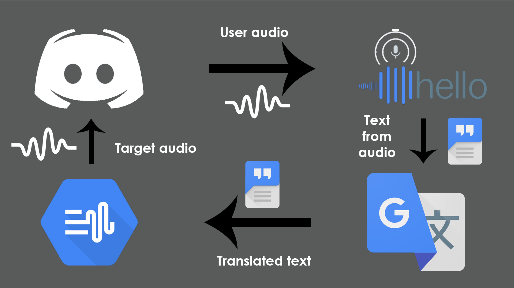

## Video

## Inspiration

With the entire world forced into lockdown, many events have moved online leaving a population of the world excluded from these opportunities. Voice calls are an integral part of online events and workshops, and people with language barriers and auditory impairments are unable to join in. With our product, we enable them to be incorporated into all online events that are held on the popular platform (Discord). This will help foster a more inclusive and connected online community.

## What it does

Project Pangaea enables two people who speak different languages to communicate through a Discord bot that performs real-time voice translation. It uses Google's robust cloud services to perform speech to text, translation and text to speech.

## How we built it

A Discord bot records the audio of the person who is "holding the mic". The audio is transcribed into text and then translated into the correct language based on the user's corresponding role using the Google Translate API. The translated text is then inputted into Google Cloud's Text to Speech API thereafter the audio is sent to the Discord bot allowing for the other user to hear the translated audio.

## Challenges we ran into

We were unable to make the conversation more seamless by having the bot listen to both users at the same time. This requires a multithreaded solution that is difficult to implement in Python. Due to this challenge, we had to resort to the holding microphone system.

## Accomplishments that we're proud of

We are proud that we were able to make a product that others can use to talk to people from around the world. The product is easily scalable due to the nature of it being only limited to the number of languages Google supports.

## What we learned

We decided to use Python to make this application but as a result, we ran into problems during development due to Python's Global Interpreter Lock we were not able to perform parallel processes.

## What's next for Project Pangaea

- Web editor to allow for easy configuration of voice channels and logging/debugging
- Companion bot for full duplex communication eliminating the need for the microphone reaction system
- Support for Group discussions (one-to-many real-time translation).

Devpost: https://devpost.com/software/project-pangaea
